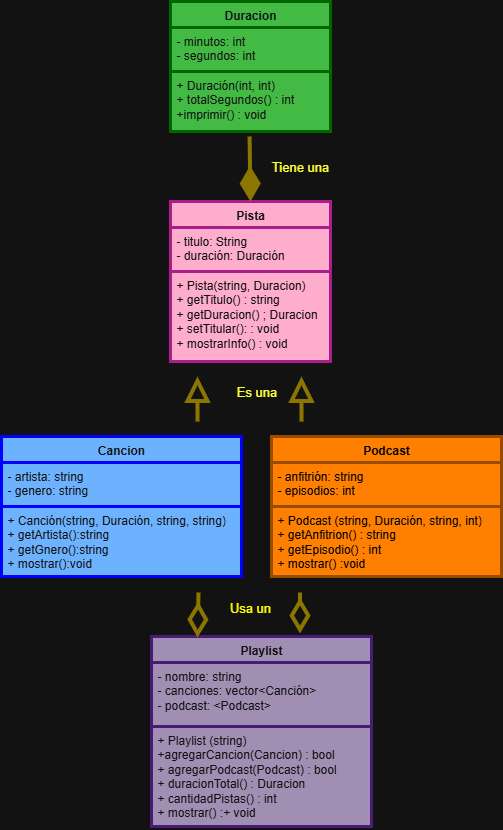

# Práctica 1: Playlist de música

Programación Orientada a Objetos · Ingeniería Mecatrónica · Tercer semestre

Llena cada espacio conforme avances en las fases de [PRACTICA.md](PRACTICA.md).

 

## Fase 1. Entender el problema

**1.1 El problema con mis propias palabras**

Tengo que realizar un codigo orientado a objetos que pueda organizar canciones y podcast dentro de una playlist. Cada cancion y podcast tiene un titulo y una duracion pero las canciones solo tienen artista y genero y para cada podcast le corresponde un anfitrion y un numero de episodios. Al final segun lo almazenado en la playlist esta podra mostrar las pistas que exixsten y la duracion total de contenido disponible dentro de la playlist.

**1.2 Sustantivos (posibles clases) y verbos (posibles métodos)**

**Sustantivos:** Cancion, pista, duracion, playlist, artista, genero, anfitrion, episodios

**Verbos:** Crear, agregar, calcular, obtener, cambiar, mostrar, imprimir, contar

**1.3 Relaciones** (completa con "es un", "tiene un" o "usa un")

*   Una canción es una pista.
*   Un podcast es una pista.
*   Una pista tiene una duración.
*   Una playlist tiene usa una canción (podcast).

 

## Fase 2. Diseñar la solución

**2.1 Diagrama de clases**

**2.2 Justificación de cada relación**

| Relación | Tipo | ¿Por qué? |
| --- | --- | --- |
| Cancion - Pista | Herencia | Una cancion es una pista por que comparte los datos de la pista (titulo y duracion).|
| Podcast - Pista | Herencia | Un podcast es una pista por que comparte los datos de la pista (titulo y duracion). |
| Pista - Duracion | Composicion | Toda pista tiene una duracion, en este caso una cancion y un podcast tiene una cantidad de segundos y minutos. |
| Playlist - Cancion | Agregacion | La playlist utiliza canciones para crearse o formarse.  |
| Playlist - Podcast | Agreagacion | La playlist tambien utiliza podcast para crearse y formarse. |

 

## Fase 3. Implementar

**3.1 Bitácora de dudas**

| # | Duda | Cómo la resolví | Fuente |
| --- | --- | --- | --- |
| 1 | ¿Cual es la difereneia entre composicion y agregacion? | Revisé si la parte debe desaparecer cuando desaparece el objeto que la contiene. | Practica.md |
| 2 | ¿Por que playlist utiliza punteros? | Porque guarda referencias a canciones y podcasts que ya existen y no debe destruirlos. | Practica.md |
| 3 | ¿Por que Cancion y Podcast heredan de Pista? | ¿Por qué usar punteros std::vector<Cancion*> en lugar de copias en la playlist? | Apuntes de clase |

**3.2 Experimentos guiados**

**Experimento 1, orden de construcción y destrucción:** Al crear una canción se construyen primero los objetos de las clases base y sus componentes. Por lo tanto, primero se construye Duracion, después Pista y finalmente Cancion y al destruirse pasa al orden contrario.

**Experimento 2, ¿quién es dueño de quién?:** Al destruir la playlist dentro del bloque, la canción continúa existiendo en el main. Esto confirma que se trata de una agregación: la playlist no administra la memoria dinámica ni destruye las pistas contenidas, ya que solo guarda punteros independientes.

**Experimento 3, un objeto en dos playlists:** Al agregar la misma canción a dos playlists y modificar su título, ambas playlists muestran el nuevo título. Esto ocurre porque ambas contienen un puntero hacia el mismo objeto Cancion, en lugar de tener copias independientes.

 

## Fase 4. Probar y mejorar

**4.1 Tabla de pruebas**

| # | Caso | Resultado esperado | Resultado obtenido | ¿Pasa? |
| --- | --- | --- | --- | --- |
| 1 | Duración normal `Duracion(3, 45)` | 3:45 | 3:45 | Si |
| 2 | Segundos mayores a 59 `Duracion(0, 75)` | 1:15 | 1:15 | Si |
| 3 | Valores negativos `Duracion(-2, 10)` | 0:00 | 0:00 | Si |
| 4 | Título vacío | "Sin título" | Sin titulo | Si |
| 5 | Playlist vacía | 0:00 y 0 pistas | 0:00 y 0 pistas | Si |
| 6 | Canción duplicada | La segunda vez devuelve `false` | false | Si |
| 7 | Puntero nulo | Devuelve `false` | false | Si |
| 8 | Total con 2 canciones y 1 podcast | Suma correcta en m:ss | Suma correcta en m:ss | Si |

**4.2 Bitácora de mejoras**

| # | Falla o mejora detectada | Qué cambié | Por qué |
| --- | --- | --- | --- |
| 1 | Los segundos podían ser mayores a 59. | Agregué la normalización de minutos y segundos en Duracion. |Para que una duración como 0:75 se muestre correctamente como 1:15.  |
| 2 | Se podían agregar canciones nulas o duplicadas. |  Agregué validaciones en agregarCancion().|  Para evitar punteros nulos y canciones repetidas dentro de la playlist.|

Retos opcionales que intenté: _____

 

## Fase 5. Publicar en GitHub

**5.1 Enlace a mi fork**

https://github.com/LuisSaSa4/ulsa_ime_3_poo_playlist.git

 

## Cierre y reflexión

**6.1 ¿Qué aprendiste en esta práctica?**

Valore mejor, supe utilizar y comprendi la importancia de un adecuado proceso de analisis del problema y diseño de la solucion, el aprender esto me ayudo a que fuera mas facil el entendimiento del problema y a imaginarme mas sencillamente como realizar el trabajo.

Tambien aprendi a identificar de mejor forma clases, atributos, metodos y la relacion entre objetos y lo mas importane de la prcatica fue que entendi la importancia del uso de herencia en el codigo a la hora de programar orientado a objetos ya que ayuda a ahorrar memoria, reduce la dificultad, facilita el mantenimiento y ayuda a la reutilizacion  futura del codigo.

**6.2 ¿Qué cambiarías de tu proceso la próxima vez?**

Implementaria y probaria cada clase de forma independiente con pequeños bloques de prueba antes de integrarlas al sistema completo, en lugar de escribir todas las clases y el main de golpe. Esto me habría permitido detectar detalles de compilación o de lógica mucho antes y realizaria commits más frecuentes y pequeños después de terminar cada clase o experimento guiado, asegurándome de compilar constantemente para evitar errores al momento.
